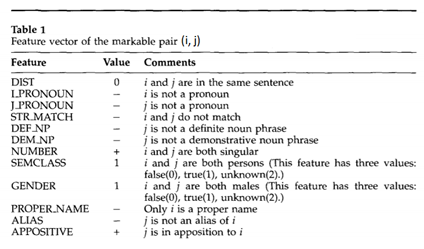

# NLPcoursework
A repo for the course project on course 521158S Natural Language Processing and Text Mining at University of Oulu.

## Project assignment
Project 8. Co-referencing Textual Analysis

1.  Consider a simple co-reference example as in the following: “The students like doing their exercises because they are aware of the benefits later on, especially with Finland increasing demand in job market”. Use NLTK parser tree to identify and visualize the penn-treebank tags associated to various token of the above sentence.

2.  We are only interested in coreference resolution associated to pronoun-name association. For instance, in the above example we should be able to associate pronoun “they” to noun “student”. For this purpose, we will initially look at this coreference resolution as a matching problem. For instance, in the above example, we realize that “they” stands for plural form, so can only be associated with nouns in plural forms either in the same sentence or sentence just before it. So, one can identify all  nouns and named-entities in the sentence and check those situated before the pronoun “they”, we then assign to the pronoun to the name/named-entity that fits some commonsense reasoning (explained in subsequent tasks).

3.  For this purpose, implement an example that would allow you to identify named-entities from a given text. You can use SpaCy named-entity tagger for instance. You can inspire from implementation available at https://towardsdatascience.com/named-entity-recognition-with-nltk-and-spacy-8c4a7d88e7da.

4.  Consider the following features that you should implement in your program. The feature assigns a value for a pair of words (i, j) of the document.

    
    table1

5.  Implement a simple coreference resolution rule that says that if a word is a pronoun then finds the noun or named-entity of the same type (plural/singular, masculine/feminine situated on the same sentence of the pronoun but before the occurrence of the pronoun. If none is found on that sentence, then look to the previous sentence. If more than one name/named-entity matches the pronoun, then assign to the name/named-entity situated closest (in terms of number of words) to the pronoun. Make use of appropriate features in Table 1 for this reasoning.

6.  Use again the example of program provided in the link above that makes use of beautiful soup to analyze website, to perform such coreference resolution on a bbc website of your choice. Report manually the accuracy of the obtained coreference resolution and comments on the limitation of such approach.

7.  Implement the Neural Coreference resolution available at https://github.com/huggingface/neuralcoref and check the results using the same bbc website as in 6)

8.  Write down an interface that allows you to enter a website or copy and past text and generate coreference resolution output using i) the approach in 6) and ii) Neural coreference resolution.

-----------------
## Käännös parhaan ymmärryksemme mukaan

Projekti 8. Sisäviittausten (co-reference) tekstuaalinen analyysi

1.  Otetaan esimerkiksi sisäviittaukset seuraavassa lauseessa: “The students like doing their exercises because they are aware of the benefits later on, especially with Finland increasing demand in job market”. Käytä NLTK parser tree:tä tokeneihin liittyvien penn-treebank tagien tunnistamiseen ja visualisoimiseen edellisessä lauseessa.

2.  Meitä kiinnostaa vain pronominimien ja nimien välinen yhteys sisäviittausten suhteen. Esimerkiksi, ylläolevassa esimerkissä meidän pitäisi pystyä liittää pronomini "they" substantiiviin "student". Tätä tarkoitusta varten sisäviittausten ratkaisua käsitellään aluksi matching-problem:ina. Esimerkiksi ylläolevassa "they" on monikko, joten se voi liittyä monikko substanttiiviin samassa tai aiemmassa lauseessa. Joten, identifioidaan kaikki substanttiivit ja named-entityt lauseessa ja tutkitaan niitä jotka esiintyy ennen "they":tä. Tämän jälkeen liitämme pronominin named-entityyn, joka on järkeenkäypä (selitetään myöhemmin)

3.  Tätä tarkoitusta varten imolementoi esimerkki joka mahdollistaa named-entityjen tunnistamisen annetusta tekstistä. Voit käyttää SpaCy-named-entity taggeria. Voit inspiroitua implementoinnista osoitteessa:  https://towardsdatascience.com/named-entity-recognition-with-nltk-and-spacy-8c4a7d88e7da.

4. Ota huomioon seuraavat ominaisuudet jotka sinun tulee implementoida omaan ohjelmaasi. Ominaisuus antaa sanaparille (i, j) arvon dokumentissa.

    
    table1
    
    
5.  Implementoi yksinkertainen sisäviittausratkaisusääntö, joka kertoo onko sana pronomini vai ei, ja jos on, löytää samantyyppisen (monikko/yksikkö, femiini, maskuliininen) substantiivin tai named-entityn lauseesta kuin pronomini. Jos samasta lauseesta ei löydy yhtään, se etsii edellisestä lauseesta. Jos useampi kuin yksi nimi tai named-entity täsmää pronominiin, niin liitä lähimpänä olevaan sanoissa laskien. Käytä taulukkoa 1 (yläpuolella).

6.  Käytä edellä ollutta linkkiä, jossa käytetään bs4:ää analysoimaan valittua BBC sivua ja löytämään sisäviittaukset. Arvioi käsin ja raportoi automaattisen sisäviittausten selvittämisen tuloksia ja tarkkuutta. Kommentoi kyseisen lähestymistavan rajoitteita.

7.  Implementoi Neural Coreference resolution linkistä: https://github.com/huggingface/neuralcoref ja tsekkaa tulokset käyttäen kohdan 6 BBC sivua.

8.  Implementoi GUI, johon voi pastea linkin tai tekstiä ja generoida sisäviittaukset käyttäen kohtaa 6) ja Neural coreference resolutinia kohdasta 7)

-----------------
-----------------
-----------------
## Project assignment
Project 10: Automatic Text Summarization 1

This project aims to implement new approaches for automatic text summarization
and evaluate their performances on small sample dataset. The Rouge-N metric is 
the standard in evaluating the

1.	First, study the open text summarization available in 
https://github.com/jaijuneja/PyTLDR It uses an extraction based summarization 
where the sentences are scored and the highly scored sentences are included in 
the summarizer. Three scoring techniques have been implemented on this package.
One is based on TextRank algorithm (it uses PageRank) and the second is based 
on Latent Semantic Analysis. (You can also check for another PageRank 
summarizer at https://github.com/davidadamojr/TextRank), while the third one 
uses relevance sentence scoring using cosine similarity, see details on the link. 
Check that the programs correctly when using either html documents or text 
documents as input. Demonstrate this finding through an example of your own 
original document and comment on the summarizer outputted by TextRank, Latent 
Semantic and Relevance sentence scoring algorithms.

2.	Design a simple GUI where the user can input a link or source file of the 
document to be summarized and output the summarizer using each of the three above 
methods.

3.	We would like to evaluate the performance of the three summarizers using a 
standard evaluation metric. ROUGE-2, ROUGE-3 are commonly employed to evaluate 
the extent of overlapping between an automatically generated abstract and a set 
of manually generated summaries. Consider the CNN/Dailymail dataset that you can 
download from https://github.com/morningmoni/FAR. You need a simple python script 
that allows you to quantify ROUGE-2 and ROUGE-3, you can inspire from numerous 
implementations available online of automatic summarizers. Your task is to assess
the performance of each of three summarizers on CNN/Dailymail dataset using 
ROUGE-2 and ROUGE-3 metrics. Comment on the performance and limitations of the 
tested algorithms.

4.	We want to extend the above summarization by incorporating coherence of text 
with respect to named-entity. For this purpose, first use SpaCy named-entity tagger 
and identify person or organization named-entity. Suggest a simple heuristic that 
enables whenever a sentence outputted by a given algorithm contains a person or an 
organization named-entity, then other sentences in the original document that contain 
the same named-entity, , if not outputted by the underlined algorithm, will also be 
included in the summarizer up to a certain threshold (that you can discuss and tune up). 
Run the newly designed algorithm on the same CNN/Dailymail dataset, and report the ROUGE-2 
and ROUGE-3 performances.

5.	Suggest a GUI where the user can input his own text to be summarized 
(or a link / pointer to the location of the original document) and output the summary 
according to each of the aforementioned methodologies.

-----------------
## Käännös parhaan ymmärryksemme mukaan

Projekti 10: Tekstin tiivistys 1

Projektin tarkoitus on kehittää uusia keinoja automaattiseen tekstin
tiivistämiseen ja testata niiden toimivuutta pienellä datasetillä.
ROUGE-N metriikka on standardi tekstin tiivistämisen arvioinnissa.

1.  Ensimmäisenä tutki open sauce tekstin tiivistäjää 
https://github.com/jaijuneja/PyTLDR. Se pisteyttää lauseet ja ottaa
mukaan tiivistelmään isoimmat pisteet saaneet. PyTLDR sisältää kolme
tiivistäjää jotka ovat: textRank algoritmi (käyttää pagerankkia), latent
semantic analysis, ja relevance sentence scoring joka käyttää cosine
similarity:ä. Tarkista että nämä kolme toimii plaintekstillä ja HTML
filuilla. Demoa tämän jälkeen omilla teksteillä.

2.  Suunnittele simppeli GUI johon voi laittaa linkin source filun
dokumentista, joka tiivistetään. Outputtina tiivistelmä kolmella eri
keinolla.

3.  Arvioi näitä kolmea tiivistäjää. Rouge2 ja Rouge3 on tyypillisesti
käytössä kun verrataan automaattista ja manuaalista tiivistystä. Käytä
CNN/Dailymail datasettia täältä https://github.com/morningmoni/FAR.
Käytä Rouge2 ja Rouge3 metriikoita näiden kolmen tiivistäjän
arviointiin kyseisellä datasetillä. Kommentoi näiden algoritmien
suorituskykyä ja rajoitetteita.

4.  Haluamme laajentaa ylläolevaa tiivistelmää ottamalla mukaan
tekstin koherenssin named-entityjen mukaan. Tähän tarkoitukseen
käytä spaCy named-entity taggeria ja identifioi henkilöt ja organisaatiot.
Ehdota yksinkertaista heuristiikka, joka tutkii valmista tiivistelmää käyden
läpi sen jokaisen lauseen. Jos jossain tiivistelmän lauseissa on nimetty enti-
teetti, niin muuta algortimia jollain thresholdilla ottamaan mukaan
herkemmin lauseita alkuperäisestä tekstistä, joissa on on sama named-entity.
Aja parannetut algoritmit samalle datasetille, ja raportoi toimintaa kuten aiemmin.

5.  Toteuta sama GUI uusille algoritmeille.

-----------------
-----------------
-----------------

